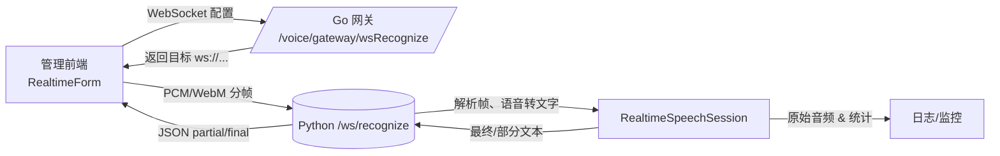
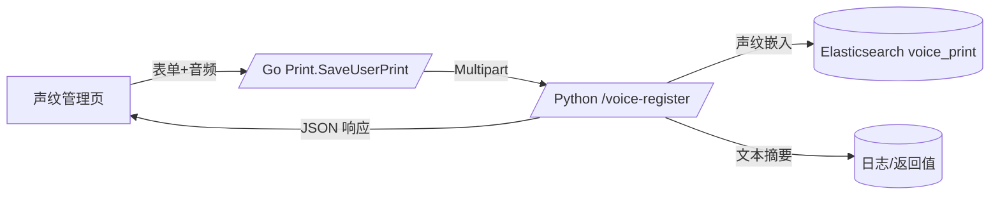
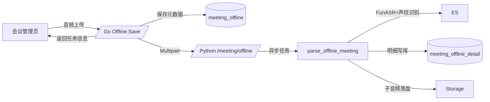

# E-Voice 项目概览与架构指南

本指南基于代码库现状汇总出整体架构、关键模块与数据流，帮助阅读者无需查阅源码即可理解系统全貌及协作方式。

## 1. 系统组成

| 子系统 | 主要职责 | 运行形态 |
| --- | --- | --- |
| **e-voice**（Python） | 提供语音识别、声纹注册、会议纪要解析、监控告警等核心服务，整合 ModelScope/FunASR 模型并对接数据库、ES。 | Flask + Socket.IO Web/WS 服务，默认 8210 端口。【F:e-voice/rest.py†L1-L25】【F:e-voice/server/app.py†L28-L54】 |
| **e-voice-admin**（Go） | 统一 API 网关与业务后台，负责账号/权限、声纹管理、会议管理等业务流程，并代理调用 Python 服务。 | Gin Web 服务，默认 8108 端口，可通过命令行参数切换配置。【F:e-voice-admin/main.go†L24-L106】 |
| **e-voice-admin-front**（Vue3） | 管理端可视化界面，提供声纹库管理、实时识别、会议纪要等操作入口。 | Vite + Arco Design 前端工程，支持本地代理与多环境变量。【F:e-voice-admin-front/vite.config.ts†L12-L131】 |

## 2. 技术栈与依赖概览

| 维度 | 关键内容 |
| --- | --- |
| 语言 & 运行时 | Python 3.8+（语音服务）、Go 1.23（网关）、Node 14+/Vite（前端）。【F:e-voice/requirements.txt†L1-L31】【F:e-voice-admin/go.mod†L1-L34】【F:e-voice-admin-front/package.json†L1-L96】 |
| 语音模型 | - ModelScope `iic/speech_paraformer-large-vad-punc_asr_nat-zh-cn-16k-common-vocab8404-pytorch`（离线识别/声纹文本纠错）。【F:e-voice/speech_recognition/recognize.py†L12-L107】 - FunASR `paraformer-zh-streaming`（流式识别备用通路）。【F:e-voice/speech_recognition/speech_recognition.py†L1-L25】 - ModelScope `speech_campplus_sv_zh-cn_16k-common`（声纹嵌入/会议说话人识别）。【F:e-voice/pipeline/spk_v_pipeline.py†L3-L19】【F:e-voice/speech_recognition/spk.py†L16-L22】 |
| 数据存储 | - PostgreSQL/MySQL（业务数据，通过 GORM/DAO 管理）。【F:e-voice-admin/resource/config.yml†L1-L14】【F:e-voice/db/db.py†L1-L26】 - Elasticsearch 8.x（声纹向量库）。【F:e-voice/es/voice.py†L1-L200】 |
| 观测与日志 | Loguru 日志体系与多日志文件（ws、音频、识别、关键事件）。【F:e-voice/server/logging.py†L8-L87】 自定义 SystemMonitor 跟踪 CPU/GPU、识别延迟、连接状态等。【F:e-voice/monitoring/system_monitor.py†L15-L200】 |

## 3. 代码目录速览

### 3.1 e-voice（Python）

- `server/`：应用工厂、蓝图注册、Socket.IO/WebSocket 路由、音频工具与会话管理。主要入口 `create_app` 在此汇总所有模块。【F:e-voice/server/app.py†L28-L54】
- `speech_recognition/`：封装 ModelScope/FunASR 推理逻辑及智能词表管理。【F:e-voice/speech_recognition/recognize.py†L12-L117】【F:e-voice/speech_recognition/vocabulary_manager.py†L1-L120】
- `pipeline/`：说话人验证向量管线，供声纹注册/会议模块复用。【F:e-voice/pipeline/spk_v_pipeline.py†L1-L19】
- `rest_prints.py` / `rest_meeting.py`：分别提供声纹管理与离线会议上传 API。【F:e-voice/rest_prints.py†L33-L129】【F:e-voice/rest_meeting.py†L55-L126】
- `biz/`、`es/`、`db/`：封装会议拆分、向量检索与数据库访问逻辑。【F:e-voice/biz/meeting/parse_offline_meeting.py†L18-L114】【F:e-voice/es/voice.py†L1-L200】【F:e-voice/db/domain/meeting_offline_detail.py†L1-L29】
- `monitoring/`：系统监控线程，输出性能及异常指标。【F:e-voice/monitoring/system_monitor.py†L15-L200】

### 3.2 e-voice-admin（Go）

- `internal/app/voice`：声纹管理与语音网关路由，整合 Python 服务接口。【F:e-voice-admin/internal/app/voice/print.go†L22-L200】【F:e-voice-admin/internal/app/voice/gateway.go†L16-L72】
- `internal/app/meeting`：会议离线处理、训练标注相关 API。【F:e-voice-admin/internal/app/meeting/offline.go†L26-L200】
- `internal/domain` / `internal/model`：DTO、Service、GORM 模型定义，用于统一数据层逻辑。【F:e-voice-admin/internal/domain/dto/meeting_offline.go†L1-L35】【F:e-voice-admin/internal/model/biz/meeting_offline_detail.go†L1-L34】
- `resource/config*.yml`：环境配置（数据库、微服务地址、白名单等）。【F:e-voice-admin/resource/config.yml†L1-L79】

### 3.3 e-voice-admin-front（Vue）

- `src/views/voice/print`：声纹管理页、实时识别弹窗与 API 封装。【F:e-voice-admin-front/src/views/voice/print/index.vue†L1-L189】【F:e-voice-admin-front/src/views/voice/print/RealtimeForm.vue†L1-L179】【F:e-voice-admin-front/src/views/voice/print/api/index.ts†L1-L25】
- `src/views/meeting/offline`：会议列表、音频上传、详情维护与训练开关。【F:e-voice-admin-front/src/views/meeting/offline/index.vue†L1-L120】【F:e-voice-admin-front/src/views/meeting/offline/AudioUpload.vue†L1-L118】【F:e-voice-admin-front/src/views/meeting/offline/api/index.ts†L1-L37】
- `src/utils/http` & `.env*`：HTTP 包装、接口/WS 地址配置、开发代理设置。【F:e-voice-admin-front/src/utils/http/index.ts†L1-L120】【F:e-voice-admin-front/.env.development†L1-L4】【F:e-voice-admin-front/vite.config.ts†L70-L90】

## 4. 功能模块一览

| 模块 | 职责 | 关键入口 |
| --- | --- | --- |
| 声纹注册/鉴定 | 上传音频并生成声纹向量、文本摘要及 ES 索引；支持在线鉴定返回最相似用户。 | Python `rest_prints.py` 提供 `/prints/get_user_prints`、`/prints/identify`；Go `Print` 服务负责账号筛选、代理转发；前端提供管理页面与表单。 【F:e-voice/rest_prints.py†L33-L129】【F:e-voice-admin/internal/app/voice/print.go†L41-L129】【F:e-voice-admin-front/src/views/voice/print/index.vue†L35-L189】 |
| 实时语音识别 | WebSocket 推理、分段结果、文本去重、指令识别、原始音频留存。 | 前端 `RealtimeForm.vue` 录音并发送分帧；Go 网关返回目标 WS 地址；Python `/ws/recognize` 处理音频与文本流。 【F:e-voice-admin-front/src/views/voice/print/RealtimeForm.vue†L53-L179】【F:e-voice-admin/internal/app/voice/gateway.go†L54-L66】【F:e-voice/server/routes/ws.py†L18-L200】 |
| 离线会议纪要 | 上传整段录音，异步拆分说话人、生成子音频、写入数据库、标记训练语料。 | 前端 `AudioUpload.vue` 提交多格式音频；Go `Offline.Save` 保存会议并调用 Python；Python `rest_meeting.py` + `parse_offline_meeting.py` 完成语音识别与声纹匹配。 【F:e-voice-admin-front/src/views/meeting/offline/AudioUpload.vue†L69-L118】【F:e-voice-admin/internal/app/meeting/offline.go†L74-L169】【F:e-voice/rest_meeting.py†L55-L126】【F:e-voice/biz/meeting/parse_offline_meeting.py†L18-L114】 |
| 数据与存储 | 向量索引、会议明细持久化、批量插入/检索。 | `es/voice.py` 构建 Dense Vector 索引并提供搜索 API；`db/domain` 封装数据库操作。 【F:e-voice/es/voice.py†L1-L200】【F:e-voice/db/domain/meeting_offline_detail.py†L1-L29】 |
| 监控与日志 | 统一日志目录、系统指标采集、连接计数。 | `server/logging.py` 配置多路日志文件；`monitoring/system_monitor.py` 定时采集并记录阈值；WS 状态接口提供实时统计。 【F:e-voice/server/logging.py†L8-L87】【F:e-voice/monitoring/system_monitor.py†L15-L200】【F:e-voice/server/routes/status.py†L1-L32】 |

## 5. 核心流程

### 5.1 实时语音识别流程

- 前端通过环境变量 `VITE_API_PY_WS_HOST` 决定目标 WebSocket 地址，并将录音帧编码为 Base64 JSON 包发送。【F:e-voice-admin-front/.env.development†L1-L4】【F:e-voice-admin-front/src/views/voice/print/RealtimeForm.vue†L53-L168】
- Go 网关返回 Python 实际 WS 地址，避免跨域限制或兼容旧路径。【F:e-voice-admin/internal/app/voice/gateway.go†L54-L66】
- Python WebSocket 端维护 `RealtimeSpeechSession`，负责音频缓存、静音检测、文本去重、原始音频落盘与统计上报。【F:e-voice/server/routes/ws.py†L18-L200】【F:e-voice/server/session.py†L1-L400】
- 识别过程中会将关键事件写入多份日志文件，便于追踪用户会话。 【F:e-voice/server/logging.py†L33-L87】

### 5.2 声纹注册流程

- 前端声纹管理页面支持“新建”“声纹管理”操作，通过 API 模块上传音频并带上用户标识。【F:e-voice-admin-front/src/views/voice/print/index.vue†L17-L189】【F:e-voice-admin-front/src/views/voice/print/api/index.ts†L1-L19】
- Go 服务读取 `py_voice` 微服务地址，将文件转发至 Python `/voice-register` 接口并回传识别结果。【F:e-voice-admin/internal/app/voice/print.go†L79-L92】【F:e-voice-admin/resource/config.yml†L66-L68】
- Python 侧处理音频、裁剪长度、语音转文字、生成声纹嵌入并写入 ES 索引，同时返回摘要与时长等信息。【F:e-voice/server/routes/voice.py†L29-L74】

### 5.3 离线会议纪要流程

- 前端组件限制上传格式、支持进度展示，并附带会议名称与时间戳。【F:e-voice-admin-front/src/views/meeting/offline/AudioUpload.vue†L30-L118】
- Go 服务创建会议记录后转发到 Python，等待异步处理并在成功后补写音频路径。【F:e-voice-admin/internal/app/meeting/offline.go†L74-L105】
- Python 将任务放入线程池，借助 FunASR `spk_pipeline` 拆分句子、裁切子音频，并利用声纹向量匹配已有用户，最终批量写入数据库。 【F:e-voice/rest_meeting.py†L55-L126】【F:e-voice/biz/meeting/parse_offline_meeting.py†L18-L114】

## 6. 模型与可观测性

| 场景 | 使用模型 | 代码位置 | 如何确认运行中模型 |
| --- | --- | --- | --- |
| 离线识别/声纹文本 | ModelScope Paraformer Large（含 VAD & Punc）。 | `speech_recognition/recognize.py` 初始化流水线。 【F:e-voice/speech_recognition/recognize.py†L12-L60】 | 首次加载时会输出日志 `✅ 使用最简单的ModelScope配置` 并在 `logs/recognition_results.log` 中记录结果。 【F:e-voice/speech_recognition/recognize.py†L12-L107】【F:e-voice/server/logging.py†L55-L76】 |
| 流式识别备用 | FunASR `paraformer-zh-streaming`。 | `speech_recognition/speech_recognition.py`。 【F:e-voice/speech_recognition/speech_recognition.py†L1-L25】 | 通过调用 `model.generate` 返回实时文本，若主模型不可用可手动切换。 |
| 声纹嵌入 | ModelScope `speech_campplus_sv_zh-cn_16k-common`。 | `pipeline/spk_v_pipeline.py`、`speech_recognition/spk.py`。 【F:e-voice/pipeline/spk_v_pipeline.py†L3-L19】【F:e-voice/speech_recognition/spk.py†L16-L22】 | 声纹注册/会议日志含 `_score` 字段，可在 ES 查询确认。 【F:e-voice/es/voice.py†L106-L198】 |
| 监控 | 自研 `SystemMonitor` 线程（CPU/GPU/延迟/连接）。 | `monitoring/system_monitor.py`。 【F:e-voice/monitoring/system_monitor.py†L15-L200】 | 在启动参数中启用监控后将输出带 component=`system_monitor` 的日志。 |

## 7. 部署与运行总览

- **Python e-voice**：设置 `EVOICE_ENV` 选择配置，安装 `requirements.txt` 后运行 `python rest.py`，默认监听 8210。【F:e-voice/config/config.py†L6-L10】【F:e-voice/requirements.txt†L1-L31】【F:e-voice/rest.py†L13-L25】
- **Go e-voice-admin**：配置 `resource/config.yml`（数据库、Python 服务地址等），使用 `go run main.go` 或 `go build` 启动，命令行参数 `-e/-c` 支持环境切换。【F:e-voice-admin/resource/config.yml†L1-L79】【F:e-voice-admin/README.md†L55-L145】
- **前端 e-voice-admin-front**：通过 `.env` 设置 `VITE_API_HOST` / `VITE_API_PY_WS_HOST`，执行 `pnpm install && pnpm run dev`（默认代理至 8108），`pnpm run build` 输出生产包。【F:e-voice-admin-front/.env†L1-L10】【F:e-voice-admin-front/.env.production†L1-L4】【F:e-voice-admin-front/vite.config.ts†L70-L131】
- **校验与工具**：`tests/` 目录提供 API/WS 验证页面与脚本，可在后端启动后执行以自检服务健康。 【F:e-voice/tests/README.md†L1-L64】

详细部署步骤、配置项与测试指引请参考对应子系统说明文档。

## 8. 常见问题与排查

1. **ModelScope 加载失败或 GPU 不可用**：`recognize.py` 会捕获异常并返回模拟结果，可结合日志判断是否需要重新下载模型或释放显存。【F:e-voice/speech_recognition/recognize.py†L37-L117】
2. **WebSocket 地址不一致**：前端 `.env*` 与 Go 配置中的 `py_voice.host` 需指向同一 Python 服务地址，否则实时识别会因跨域或 404 失败。【F:e-voice-admin-front/.env.development†L1-L4】【F:e-voice-admin/resource/config.yml†L66-L68】
3. **监控线程未启动**：如缺失依赖会在启动时输出 “系统监控模块不可用”，需确认 `monitoring/system_monitor.py` 所依赖的 `psutil/torch` 可用。【F:e-voice/server/monitoring.py†L7-L20】
4. **会议任务失败**：查看 `parse_offline_meeting` 日志，确认音频格式与 ES/数据库连接可用；异常会被记录并回传 `failed` 状态。【F:e-voice/biz/meeting/parse_offline_meeting.py†L18-L104】

## 9. 文档体系

本次新增的项目文档位于 `e-docs/2025-项目指南/`，子系统细化说明请参阅同目录下的专题文档：

- 《网关服务 e-voice-admin 详解》
- 《管理前端 e-voice-admin-front 详解》
- 《文档规范》

统一文档规范与模板见《文档规范》一文，以确保后续补充资料格式一致、落地路径明确。

