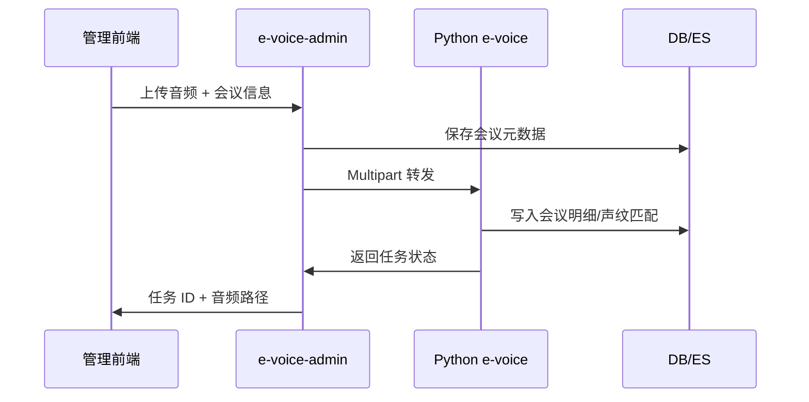

# 网关服务 e-voice-admin 详解

本文梳理 Go 网关服务的运行环境、目录结构、核心流程与常见运维要点，帮助研发、测试与运维在不查阅源码的情况下理解整体行为及与 Python 语音服务的协作方式。

## 1. 服务概述

- **定位**：作为统一业务后台与语音网关，负责账号/权限管理、声纹库维护、离线会议调度，并代理访问 Python 语音服务的 REST/WS 接口。【F:e-voice-admin/main.go†L24-L106】
- **运行形态**：Gin Web 服务，默认端口 8108，启动时根据配置动态加载静态资源、OpenAPI 文档与反向代理规则。【F:e-voice-admin/main.go†L52-L105】【F:e-voice-admin/internal/route/router.go†L24-L97】
- **核心外部依赖**：关系型数据库（PostgreSQL/MySQL）、Redis、Python e-voice 服务、可选 Elasticsearch（通过 Python 服务间接访问）。【F:e-voice-admin/resource/config.yml†L1-L79】

## 2. 技术栈与主要依赖

| 范畴 | 说明 |
| --- | --- |
| 语言与运行时 | Go 1.23（`go.mod` 指定）。【F:e-voice-admin/go.mod†L1-L34】 |
| Web 框架 | Gin、Gin CORS、Gin 静态资源插件，用于路由与跨域治理。【F:e-voice-admin/internal/route/router.go†L24-L97】 |
| 数据访问 | GORM（MySQL/Postgres 驱动）、go-redis、pgx，支撑业务数据与缓存。【F:e-voice-admin/go.mod†L5-L75】 |
| 中间件组件 | JWT 验证、限流 `tollbooth`、日志 `logx`、OpenAPI 静态文件、IOC 容器等。【F:e-voice-admin/main.go†L7-L21】【F:e-voice-admin/internal/route/router.go†L64-L83】 |
| 多媒体处理 | `ffmpeg-go`、`imaging`、`freetype` 等用于后台图形/音频扩展（主要供后台工具与训练模块使用）。【F:e-voice-admin/go.mod†L5-L34】 |

## 3. 配置与运行环境

| 配置项 | 作用 | 关键字段 |
| --- | --- | --- |
| `dbconf` | 关系型数据库连接（驱动、地址、凭证），用于业务与会议明细存储。| `driver`/`hostname`/`username`/`database`。【F:e-voice-admin/resource/config.yml†L1-L14】 |
| `redis` | 缓存与会话存储。| `host`/`port`/`db`。【F:e-voice-admin/resource/config.yml†L15-L18】 |
| `app` | 服务端口、跨域白名单、无需鉴权的路由、代码生成目标路径等。| `port`、`allowurl`、`noVerifyToken`、`vueobjroot`。【F:e-voice-admin/resource/config.yml†L30-L61】 |
| `micro.py_voice.host` | Python 语音服务地址。所有声纹注册、识别、会议任务均通过该地址调用 Python 模型，部署时需与真实模型实例保持一致。| `py_voice.host`。【F:e-voice-admin/resource/config.yml†L66-L68】 |
| `log` | 日志等级与落盘策略。| `level`、`enable-router-log`、`filename` 等。【F:e-voice-admin/resource/config.yml†L69-L79】 |

> **如何确认使用的语音模型？**
> Go 网关仅转发请求，不直接加载模型；实际识别模型由 `py_voice.host` 指向的 Python 服务负责。部署后可通过该服务的日志（详见《后端服务 e-voice 详解》）确认当前加载的 ModelScope/FunASR 模型版本，并结合网关配置判断调用链路。

## 4. 目录结构总览

| 路径 | 责任 |
| --- | --- |
| `main.go` | 程序入口：读取配置、注入 IOC、初始化路由、启动 HTTP 服务及优雅停机。 【F:e-voice-admin/main.go†L24-L106】 |
| `internal/route/` | 路由与全局中间件配置：跨域、限流、JWT、静态资源、路由绑定。 【F:e-voice-admin/internal/route/router.go†L24-L97】 |
| `internal/app/voice/` | 声纹相关接口与 Python 服务网关，包括用户声纹列表、注册、鉴定、实时识别代理。 【F:e-voice-admin/internal/app/voice/print.go†L22-L200】【F:e-voice-admin/internal/app/voice/gateway.go†L1-L72】 |
| `internal/app/meeting/` | 离线会议管理：列表、上传、详情标注、训练开关等。 【F:e-voice-admin/internal/app/meeting/offline.go†L43-L196】 |
| `internal/domain/` & `internal/model/` | DTO、服务层、GORM 模型定义，统一封装数据库访问。 |
| `pkg/` | 公共工具（HTTP 客户端、结果封装、IOC、日志等），为业务模块提供基础能力。 |
| `resource/` | 配置文件、静态资源与业务前端部署文件。 【F:e-voice-admin/resource/config.yml†L1-L79】 |
| `dev_tools/` | 数据迁移、代码生成等辅助工具。运行 `go run dev_tools/migrate/main.go` 可初始化数据库结构。 【F:e-voice-admin/README.md†L17-L47】 |

## 5. 核心功能与流程

### 5.1 声纹管理与注册

1. **用户筛选**：`GetUserList` 根据角色 ID（默认 26）筛选拥有声纹权限的账号并分页返回。 【F:e-voice-admin/internal/app/voice/print.go†L41-L60】
2. **声纹查询**：`GetUserPrints` 通过 HTTP 客户端调用 Python `/prints/get_user_prints` 接口，统一回传分页结果。 【F:e-voice-admin/internal/app/voice/print.go†L62-L77】
3. **注册与鉴定**：
   - 上传音频后转发至 Python `/voice-register` 完成声纹嵌入与文本摘要，并返回处理结果。 【F:e-voice-admin/internal/app/voice/print.go†L79-L92】
   - `Identify` 将音频流转发到 `/prints/identify`，结合 Python 返回的候选列表按得分权重选出最匹配用户。 【F:e-voice-admin/internal/app/voice/print.go†L108-L185】
4. **权限声明**：`Perms` 将相关路由映射至权限码，供后台权限系统控制访问。 【F:e-voice-admin/internal/app/voice/print.go†L188-L200】

### 5.2 实时语音识别通路

- `Gateway` 模块提供 REST 代理（`/voice/gateway/voice-recognize-*`）与 WebSocket 配置接口。默认返回 Python 服务的 WS 地址，前端据此直连，避免在 Go 端再实现中继。 【F:e-voice-admin/internal/app/voice/gateway.go†L16-L66】
- 请求在进入 Gin 前依次经过错误捕获、限流、合法性校验、JWT 验证与跨域处理，确保高并发场景下的安全与稳定。 【F:e-voice-admin/internal/route/router.go†L64-L83】

### 5.3 离线会议纪要流程

1. **列表与状态维护**：`Get_list`/`Update`/`UpStatus`/`Del` 提供常规 CRUD 与状态变更。 【F:e-voice-admin/internal/app/meeting/offline.go†L43-L118】
2. **上传调度**：`Save` 首先将会议信息写入数据库，再将音频通过 `py_voice` 转发到 Python `/meeting/offline`，并根据返回结果更新音频路径。 【F:e-voice-admin/internal/app/meeting/offline.go†L73-L105】
3. **详情标注与训练集成**：`GetDetail` 聚合会议分段并关联用户信息；`UpdateDetail`/`TrainDetail` 支持文稿修改与训练数据入库，必要时异步写入微调语料表。 【F:e-voice-admin/internal/app/meeting/offline.go†L121-L196】

流程示意：



## 6. 数据交互与外部服务

| 方向 | 说明 |
| --- | --- |
| Go → Python | 通过 `httpclient`/`gf.NewHttpRequest` 将音频文件或 JSON 请求转发到 Python 服务，负责语音识别、声纹嵌入与会议拆分。 【F:e-voice-admin/internal/app/voice/print.go†L79-L118】【F:e-voice-admin/internal/app/meeting/offline.go†L85-L105】 |
| Go → DB | 采用服务层封装（`service.MeetingOffline` 等）调用 GORM 写入会议、声纹等业务表。 【F:e-voice-admin/internal/app/meeting/offline.go†L73-L196】 |
| Go → Redis | 主要用于会话与缓存（细节位于 `internal/domain` 与 `pkg`），在配置中统一声明连接参数。 【F:e-voice-admin/resource/config.yml†L15-L18】 |
| 静态资源 | `router.go` 将 `resource/webadmin`、`resource/webbusiness`、声纹与会议音频目录映射为静态访问路径，便于前端直接下载。 【F:e-voice-admin/internal/route/router.go†L39-L46】 |

## 7. 运行与部署

1. **本地运行**：
   ```bash
   cd e-voice-admin
   go run main.go            # 默认使用 resource/config.yml
   go run main.go -e prod    # 切换到 resource/config-prod.yml
   go run main.go -c ./config-custom.yml
   ```
   【F:e-voice-admin/README.md†L61-L74】
2. **编译部署**：
   ```bash
   go build -o main main.go  # 或 sh build.sh 生成 Linux 二进制
   ./main -e prod            # 指定环境
   ```
   将生成的可执行文件与 `resource/` 目录一并部署到服务器。 【F:e-voice-admin/README.md†L80-L145】
3. **数据库迁移**：运行 `dev_tools/migrate/main.go` 可初始化/更新数据表，确保业务页面正常使用。 【F:e-voice-admin/README.md†L17-L47】

## 8. 观测与安全

- **安全控制**：
  - JWT 鉴权 + 接口合法性校验（时间戳 + MD5）防止未授权调用。 【F:e-voice-admin/internal/route/router.go†L64-L83】【F:e-voice-admin/resource/config.yml†L38-L60】
  - `LimitHandler` 使用 `tollbooth` 实现限流，避免暴力请求影响语音后端。 【F:e-voice-admin/internal/route/router.go†L74-L75】
- **日志与监控**：`logx` 支持控制台/文件输出，配置中可开启 SQL、路由日志；必要时结合 Python 服务的系统监控获取完整链路指标。 【F:e-voice-admin/resource/config.yml†L69-L79】
- **静态资源防护**：通过 `noVerifyToken`/`noVerifyAPI` 控制无需登录即可访问的路径，部署时需确认是否符合安全策略。 【F:e-voice-admin/resource/config.yml†L55-L61】

## 9. 常见问题与排查

1. **实时识别无法连接**：确认 `py_voice.host` 指向实际部署的 Python 服务，且前端 `.env` 中的 WebSocket 地址与之匹配。 【F:e-voice-admin/resource/config.yml†L66-L68】
2. **会议上传成功但无结果**：检查 Python 服务日志以及数据库连接；`Save` 成功后会将返回的 `audio_name` 写回会议记录，可据此定位。 【F:e-voice-admin/internal/app/meeting/offline.go†L96-L105】
3. **声纹鉴定返回未知用户**：`ensureUserId` 会根据得分加权选取最终用户，若 ES 没有匹配向量将返回 0；需检查声纹库与 Python 服务插入逻辑。 【F:e-voice-admin/internal/app/voice/print.go†L132-L185】
4. **跨域或 401 错误**：确认 `allowurl` 白名单与 JWT 设置是否覆盖当前前端域名，并检查路由是否在 `noVerifyToken` 或权限列表中。 【F:e-voice-admin/resource/config.yml†L40-L61】【F:e-voice-admin/internal/app/voice/print.go†L188-L200】

---

通过以上说明，可快速了解 e-voice-admin 网关的职责、调用链与部署要点，并结合 Python/前端文档定位端到端问题。
