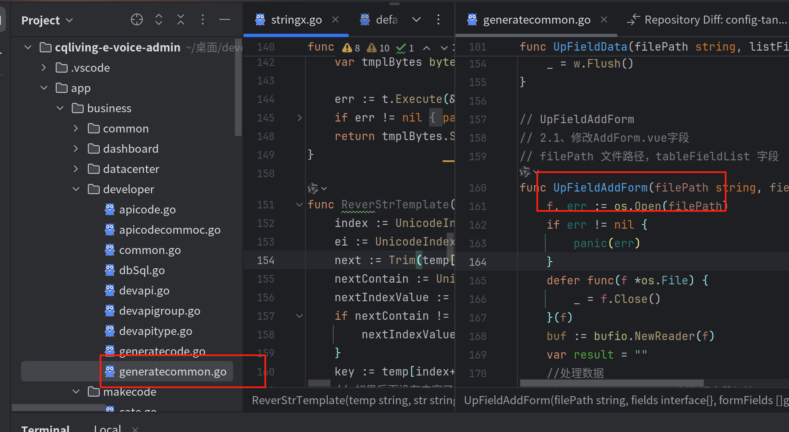

## 官方文档

参考官方文档 https://doc.goflys.cn/docview?id=25

官方仓库地址 https://gitee.com/huang_li_shi_admin/GoFlyAdmin

## 开发流程

> 1、本地安装和部署前后端项目

后台需要配置好前端代码的项目位置 `resource/config.yml`
```
 # 配置代码生成时-前端代码根目录位置(开发必改)
 vueobjroot: /home/leozy/桌面/developer/git/leo/e-voice/e-voice-admin-front
```

> 2、数据库建表

首先，根据你的数据库类型（MySQL, PostgreSQL等），创建数据库和用户。例如，对于 PostgreSQL：

```sql
create schema gofly_single collate utf8mb4_general_ci;
create user gofly identified by 'gofly';
grant all on gofly_single.* to gofly;
```

然后，你可以通过 GORM 的自动迁移功能来创建表结构。项目提供了一个 `dev_tools/migrate` 工具来帮助你完成这个过程。

*   检查并修改 `dev_tools/migrate/main.go` 文件中的数据库配置路径 (`config.Sp.ConfigPath`) 和需要迁移的模型。
*   运行 `dev_tools/migrate/main.go` 来自动创建表：
    ```bash
    cd dev_tools/migrate
    go run main.go
    ```

你也可以参考 `dev_tools/dbtest/db_test.go` 来了解如何手动操作数据库。

建表字段参考：https://doc.goflys.cn/docview?id=26&fid=946

> 3、生成代码

 - 去后台管理菜单->开发者->生成代码，建表之后会刷新出新的表信息
 - 点击`生成代码`会弹出生成配置信息，填写好之后点击确认`生成代码`
 - 所有数据库操作的测试用例，参考：[db_test.go](dev_tools/dbtest/db_test.go)

-> 4、vue表单组件可以参考： [generatecommon.go](internal/app/developer/generatecommon.go)
`UpFieldAddForm`



> 前端代码会生成到指定的前端位置下
后端代码生成成功后自行重启一下服务
后台管理就可以看到新的菜单

## 启动项目

项目可以通过多种方式启动，具体取决于你是直接运行 Go 代码还是运行编译后的二进制文件。

### 直接运行 Go 代码 (推荐用于本地开发)

你可以使用 `go run` 命令直接运行项目：

```bash
# 使用默认配置文件 resource/config.yml
go run main.go

# 指定环境启动  `-e xxx`,会读取指定的配置文件,格式: `resource/config-{环境名}.yml`
# 例如，使用 resource/config-prod.yml 配置文件启动
go run main.go -e prod

# 指定配置文件路径 `-c xxx`,会读取指定的配置文件,格式: `xxx.yml`
# 例如，使用当前目录下的 config-custom.yml 配置文件启动
go run main.go -c ./config-custom.yml
```

### 运行编译后的二进制文件

首先，你需要编译项目。你可以使用 `go build` 命令或项目提供的 `build.sh` 脚本。

#### 使用 `go build` 编译

```bash
# 编译生成 main 可执行文件
go build -o main main.go
```

#### 使用 `build.sh` 脚本编译 (生成 Linux 二进制)

```bash
# 运行脚本编译并压缩 (默认生成名为 gofly 的 Linux 二进制文件)
sh build.sh
```

编译完成后，你可以运行生成的二进制文件：

```bash
# 使用默认配置文件 resource/config.yml
# 注意：resource 文件夹需要与主程序在同一目录下
./main
# 或者在 Windows 上
main.exe

# 指定环境启动  `-e xxx`,会读取指定的配置文件,格式: `resource/config-{环境名}.yml`
# 例如，使用 resource/config-prod.yml 配置文件启动
./main -e prod

# 指定配置文件路径 `-c xxx`,会读取指定的配置文件,格式: `xxx.yml`
# 例如，使用当前目录下的 config-custom.yml 配置文件启动
./main -c ./config-custom.yml
```

## 打包部署

要将项目部署到服务器，你需要将编译后的二进制文件和配置文件一起打包。

### 步骤

1.  **编译项目**:
    *   你可以使用 `go build` 命令编译生成适用于当前平台的二进制文件：
        ```bash
        go build -o main main.go
        ```
    *   或者使用项目提供的 `build.sh` 脚本编译生成 Linux 平台的二进制文件（名为 `gofly`）：
        ```bash
        sh build.sh
        ```
        > 注意：`build.sh` 脚本默认会生成 Linux 平台的二进制文件，并使用 `upx` 进行压缩。你需要确保系统已安装 `upx`。

2.  **拷贝必要文件**:
    *   将编译生成的二进制文件（`main` 或 `gofly`）和整个 `resource` 文件夹复制到目标服务器的同一目录下。
    *   `resource` 文件夹包含了程序运行所需的配置文件、静态资源等。

3.  **在服务器上运行**:
    *   在目标服务器上，进入包含二进制文件和 `resource` 文件夹的目录。
    *   通过指定环境或配置文件来运行程序：
        ```bash
        # 使用默认配置 resource/config.yml
        ./main

        # 使用指定环境的配置 resource/config-prod.yml
        ./main -e prod

        # 使用指定的配置文件
        ./main -c /path/to/your/config.yml
        ```

## 开发注意

- **错误处理**: 如果在业务逻辑中遇到不想立即处理的错误（`error`），可以直接使用 `panic`。项目已经在 Gin 中添加了全局异常捕获中间件 ([error.go](internal/route/middleware/error.go))，它会捕获 `panic` 并将错误信息返回给前端。
- **定时任务**: 如果在定时任务中可能会发生 `panic`，请务必在调用前使用 `recover` 进行捕获，以防止程序崩溃。

